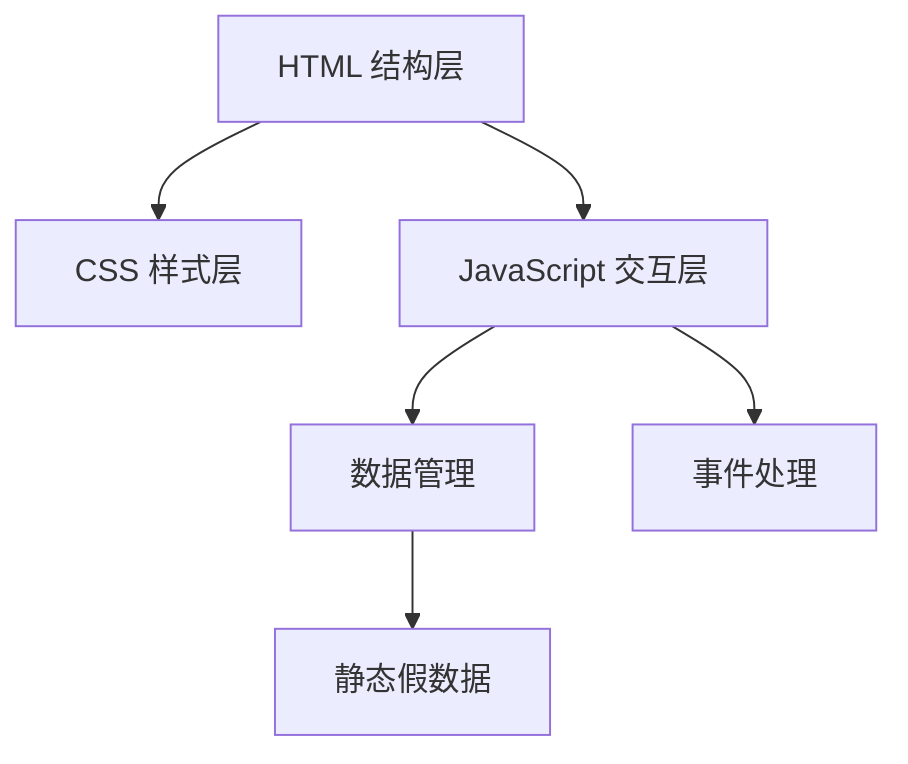

## 1. 架构设计
纯前端应用架构，使用静态文件部署，无需后端服务。



## 2. 技术描述
- **前端**：HTML5 + CSS3 + 原生 JavaScript (ES6+)
- **部署方式**：静态文件部署（可直接在浏览器打开）
- **响应式设计**：CSS Flexbox/Grid + Media Queries
- **动画效果**：CSS3 transitions 和 animations

## 3. 文件结构
| 文件路径 | 用途 |
|-------|---------|
| /index.html | 首页 - 电影列表和搜索 |
| /detail.html | 详情页 - 电影详情和评论 |
| /style.css | 通用样式文件 |
| /script.js | 交互逻辑脚本 |

## 4. 数据模型

### 4.1 电影数据结构
```javascript
// 电影对象
{
  id: string,
  title: string,
  poster: string,        // 海报图片URL
  rating: number,       // 评分 0-10
  genre: string[],      // 类型
  director: string,
  cast: string[],
  releaseYear: number,
  duration: string,
  synopsis: string,
  comments: Comment[]
}

// 评论对象
{
  id: string,
  username: string,
  avatar: string,
  rating: number,
  content: string,
  date: string
}
```

### 4.2 静态假数据
预生成10+部电影数据，包含完整信息和示例评论，无需外部API。

## 5. 核心功能实现方案
### 5.1 页面导航
使用 URL query 参数传递电影 ID，通过 JavaScript 解析并显示对应内容。

### 5.2 搜索功能
前端实时过滤电影数据，无需后端请求。

### 5.3 评分星级
使用 CSS 实现星级显示，支持半星和完整星级。

### 5.4 评论提交
前端模拟提交，保存在内存中，刷新页面重置。
