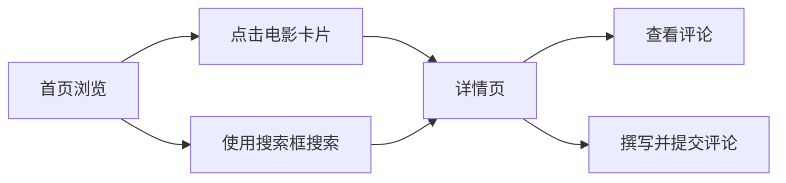

## 1. 产品概述
影评App是一个电影发现和评论平台，提供美观的电影浏览体验和详细的电影信息展示。
- 主要目的是让用户发现优秀电影，查看电影详情、评分和评论，并分享自己的观影感受
- 目标用户是电影爱好者，追求优质的观影体验和互动社区

## 2. 核心功能

### 2.1 用户角色
该产品暂不需要角色区分，所有访问者都可以使用完整功能。

### 2.2 功能模块
1. **首页**：电影海报列表、搜索功能、分类筛选、评分显示
2. **详情页**：电影详情展示、完整评分、剧情简介、评论区、评论输入框

### 2.3 页面详情
| 页面名称 | 模块名称 | 功能描述 |
|-----------|-------------|---------------------|
| 首页 | 电影列表 | 展示电影海报网格，包含海报、标题、评分星级 |
| 首页 | 搜索功能 | 顶部搜索框，支持按电影名称搜索 |
| 详情页 | 电影信息 | 大图海报、标题、导演、演员、上映时间、时长、评分 |
| 详情页 | 剧情简介 | 展示电影剧情描述 |
| 详情页 | 评论区 | 展示已有评论、评论输入框、提交评论 |

## 3. 核心流程
用户在首页浏览电影海报，点击电影卡片进入详情页查看完整信息，查看评论，也可以搜索感兴趣的电影。

## 4. 用户界面设计
### 4.1 设计风格
- **主色调**：深色背景 (#0f0f0f) 配合霓虹蓝 (#00d4ff) 作为强调色
- **辅助色**：金色 (#ffc107) 用于星级评分
- **按钮风格**：圆角设计，带有微妙的阴影和悬停效果
- **字体**：使用 Inter 作为主字体，搭配清晰的层级结构
- **布局风格**：卡片式网格布局，响应式设计，支持移动端和桌面端
- **图标/emoji风格**：使用简约线性图标，电影相关的emoji增强视觉趣味

### 4.2 页面设计概述
| 页面名称 | 模块名称 | UI元素 |
|-----------|-------------|-------------|
| 首页 | 电影列表卡片 | 海报图占主视觉，悬停放大效果，底部信息条 |
| 详情页 | 英雄区域 | 电影海报大图，渐变叠加，关键信息排版 |
| 评论区 | 评论卡片 | 用户头像、昵称、星级评分、评论内容、时间戳 |

### 4.3 响应性
桌面端优先设计，完全适配移动端；触摸交互优化，点击区域足够大，滚动体验流畅。
